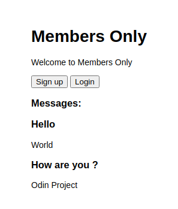
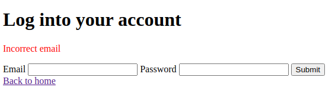
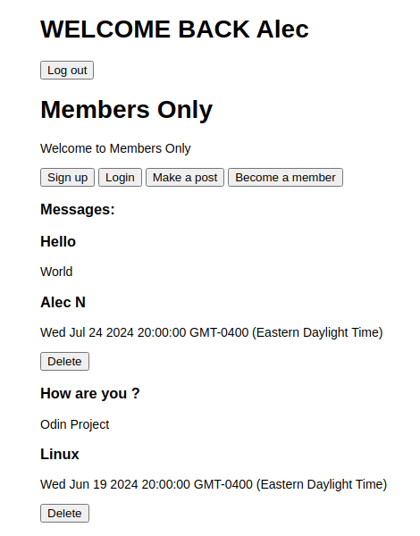
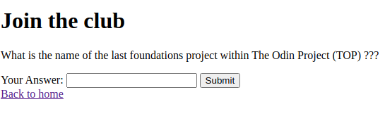
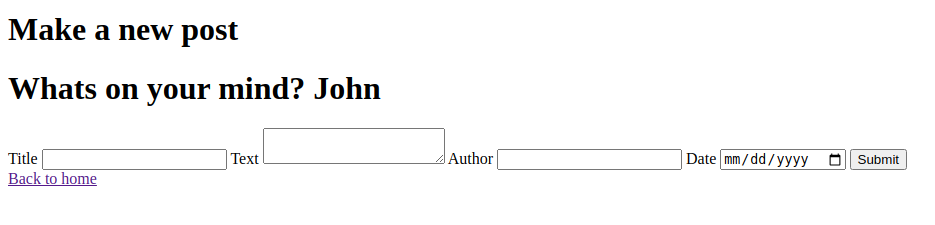
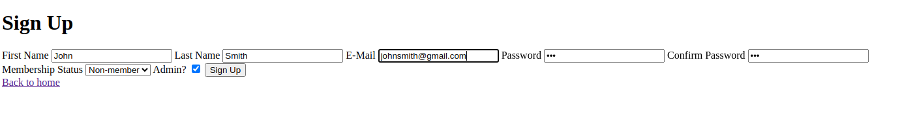
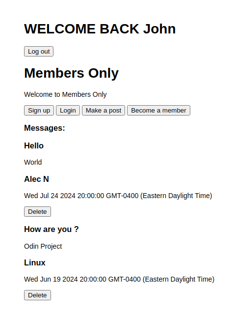

<h1>About This Project</h1> 
This project was designed to practice user authentication and implement logic that grants different access levels to various members. It provided valuable experience in user authentication using Passport.js. Built with MongoDB, Express.js, Node.js, JavaScript, and EJS. 

<br> 

<h1>What I learned</h1>
    <ul>
    <li>User authentication with Passport.js</li>
<li>Using the MVC pattern to structure the website and separate code</li>
<li>Practice with Express.js middleware to handle requests and asynchronous operations</li>
<li>Form validation and sanitization</li>
<li>Properly storing data using a MongoDB database</li>
<li>Passing data from the backend to the frontend</li>
<li>Using EJS and views to render data and conditionally display content based on membership status or admin privileges</li>

 

 <h1>Build With</h1>

 
 
 
 
  
 


<h1>Getting Started</h1>

To get project cloned locally: git clone git@github.com:alecnissen/members-only.git

then ``` npm install ``` which will install all dependency's and packages.

<h1>Features</h1>

- All messages are displayed on the home page for the user to see.



- Users can login and forms also include validation checks to make sure credentials are valid. It will display incorrect password or email.



- Welcome page if user authentication is successful using conditional rendering within EJS view.



- Users can become a member by answering a question. If successful they will be able to see the author and date of the messages. 



- Users Can make posts.



- When users sign up they can choose to become an admin.



- If the user is an admin they will have the ability to see all the contents of the messages including title, text, author, date as well as the ability to delete messages.



<h1>Acknowledgments</h1> Thank you to everyone within The Odin Project Curriculum from the bottom of my heart! Thank you to anyone who helped me in the discord channels. I promise to help others throughout this journey. 

<h1>Contact</h1>

Creator: Alec J Nissen 
<br>
E-Mail: alecnissen@yahoo.com
<br>
GitHub: https://github.com/alecnissen/members-only